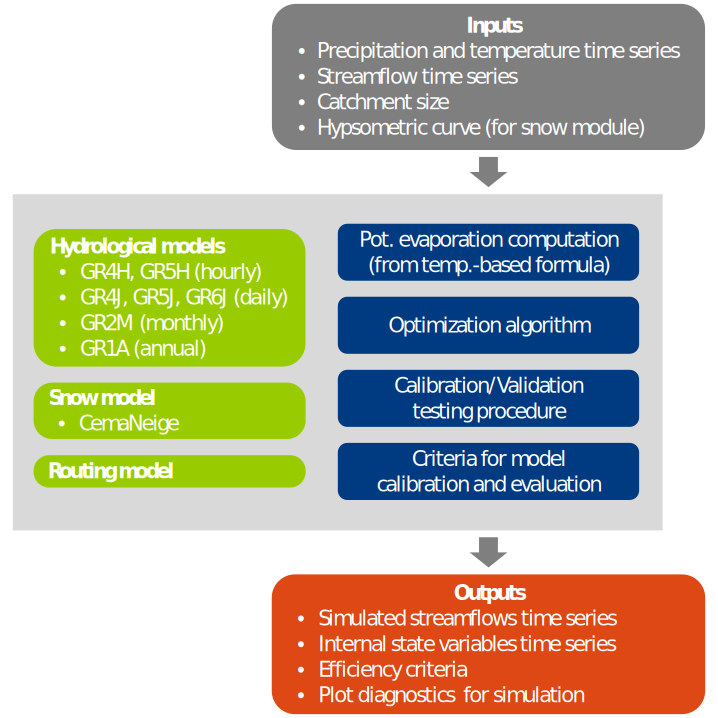

<table  width="100%">
<tbody>
  <tr>
  <td width="125"></td>
  <td><h4>

To obtain help regarding the use of the <strong>airGRteaching</strong> or <strong>airGR</strong> packages, or to suggest modifications, send an email to <strong>airGR@inrae.fr</strong>

</h4>
  </tr>
</tbody>
</table>

 

<strong>airGRteaching</strong> is a package developed in the  language devoted to the use of the <strong><a href = 'https://webgr.inrae.fr/en/models/' title='GR models' rel='noopener noreferrer' onclick='window.open(this.href); return false;'>GR</a></strong> rainfall-runoff models and the <strong><a href = 'https://webgr.inrae.fr/en/models/snow-model/' title='CemaNeige' rel='noopener noreferrer' onclick='window.open(this.href); return false;'>CemaNeige</a></strong> snowmelt and accumulation model by students and teachers.
 
 <strong>airGRteaching</strong> is an add-on package of the <strong><a href = 'https://hydrogr.github.io/airGR/' title='airGR' rel='noopener noreferrer' onclick='window.open(this.href); return false;'>airGR</a></strong> hydrological package.
 It simplifies the use of the airGR functionalities as it only requires a basic level of programming.
 
 
The <strong><a href = 'https://webgr.inrae.fr/en/models/' title='GR models' rel='noopener noreferrer' onclick='window.open(this.href); return false;'>GR</a></strong> hydrological models in a few words:

* lumped conceptual rainfall-runoff models (<strong><a href = 'https://webgr.inrae.fr/en/models/annual-hydrologic-model-gr1a/' title='GR1A' rel='noopener noreferrer' onclick='window.open(this.href); return false;'>GR1A</a></strong>, <strong><a href = 'https://webgr.inrae.fr/en/models/monthly-model-gr2m/' title='GR2M' rel='noopener noreferrer' onclick='window.open(this.href); return false;'>GR2M</a></strong>, <strong><a href = 'https://webgr.inrae.fr/en/models/daily-hydrological-model-gr4j/' title='GR4J' rel='noopener noreferrer' onclick='window.open(this.href); return false;'>GR4J</a></strong>, **GR5J**, **GR6J**, **GR4H** and **GR5H**)
* designed with the objective to be as efficient as possible for flow simulation at various time steps (from annual to hourly)
* their structures were developed to have warranted complexity and limited data requirements
* can be applied on a wide range of conditions, including snowy catchments (thanks to the <strong><a href = 'https://webgr.inrae.fr/en/models/snow-model/' title='CemaNeige' rel='noopener noreferrer' onclick='window.open(this.href); return false;'>CemaNeige</a></strong> snow model)
  

#### <strong>airGRteaching</strong> features

* Only three simple functions for a full modelling exercise:
    + data preparation
    + model calibration
    + model simulation
* Pre-defined graphical plots:
    + static plotting functions
    + mouse events and interactive graphics (using the *dygraphs* JavaScript charting library)
* Graphical user interface based on *Shiny*:
    + interactive flow simulation and plotting with parameters modifications
    + automatic calibration button
    + internal variables evolution graphs
    + time period selection
    + only monthly and daily models are currently available (<strong><a href = 'https://webgr.inrae.fr/en/models/monthly-model-gr2m/' title='GR2M' rel='noopener noreferrer' onclick='window.open(this.href); return false;'>GR2M</a></strong>, <strong><a href = 'https://webgr.inrae.fr/en/models/daily-hydrological-model-gr4j/' title='GR4J' rel='noopener noreferrer' onclick='window.open(this.href); return false;'>GR4J</a></strong>, **GR5J**, **GR6J** + <strong><a href = 'https://webgr.inrae.fr/en/models/snow-model/' title='CemaNeige' rel='noopener noreferrer' onclick='window.open(this.href); return false;'>CemaNeige</a></strong>)
    + a demonstrator of the graphical interface is available for free online on the <strong><a href = 'https://sunshine.inrae.fr/' title='sunshine.inrae.fr' rel='noopener noreferrer' onclick='window.open(this.href); return false;'>Sunshine</a></strong> website
    
See the "Get started" tab for examples including  commands.
  

#### <strong>airGR</strong> features

- Easy implementation on numerous catchments 
- Data requirements limited to lumped precip., temp. and streamflow time series
- One automatic calibration procedure
- A set of efficiency criteria
- Limited computation times (use of Fortran routines to run the models)
- Pre-defined graphical plots
- Outputs include simulated flow time series and internal variables
- User can implement its own models, efficiency criteria or optimization algorithms
- Possibility to run semi-distributed versions of the models (use facilitated by the <strong><a href = 'https://airgriwrm.g-eau.fr/' title='airGRiwrm' rel='noopener noreferrer' onclick='window.open(this.href); return false;'>airGRiwrm</a></strong> package)

 

