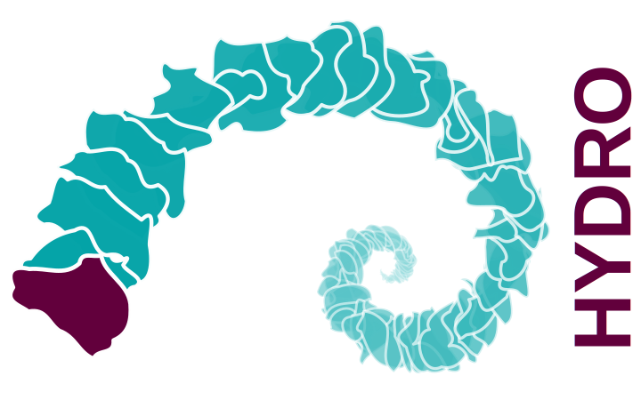
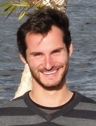
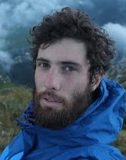
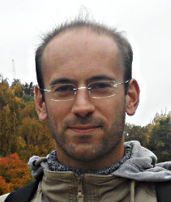
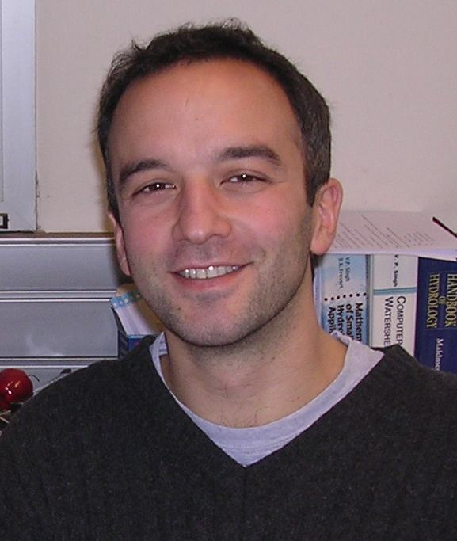

<table  width="100%">
<tbody>
  <tr>
  <td width="110"></td>
  <td width="130"></td>
  <td>The <strong><a href = 'https://webgr.inrae.fr/en/models/' onclick='window.open(this.href); return false;'>GR</a></strong> models and the <strong><a href = 'https://hydrogr.github.io/airGR/' onclick='window.open(this.href); return false;'>airGR</a></strong> &amp; <strong><a href = 'https://hydrogr.github.io/airGRteaching/' onclick='window.open(this.href); return false;'>airGRteaching</a></strong> packages are developed by the <strong><i><a href = 'https://webgr.inrae.fr/en/' onclick='window.open(this.href); return false;'>Catchment Hydrology Team</a></i></strong> of <strong><a href = 'http://www.inrae.fr/en/' onclick='window.open(this.href); return false;'><strong>INRAE</strong></a></strong> at Antony, France.
  </tr>
</tbody>
</table>
  
 

#### <strong>airGRteaching</strong> authors and contributors

<table  width="100%">
<tbody>

  <tr>
  <td width="115"></td>
  <td><strong>Olivier DELAIGUE</strong>
   <strong><i>Data scientist</i></strong>
   INRAE
   Main developer of the package
   Maintainer of the package
  </tr>
  
  <tr>
  <td width="115"></td>
  <td><strong>Laurent CORON</strong>
   <strong><i>Hydrological and meteorological forecaster</i></strong> Now at Electricity of France (EDF)
   Co-developer
  </tr>

  <tr>
  <td width="115"></td>
  <td><strong>Pierre BRIGODE</strong>
   <strong><i>Hydrologist</i></strong> Now at the university of Nice - Polytech
   Co-developer
  </tr>
  
  <tr>
  <td width="115"> </td>
  <td><strong>Guillaume THIREL</strong>
   <strong><i>Hydrologist</i></strong>
   INRAE
   Contributor
  </tr>

</tbody>
</table>

    

#### <strong>airGR</strong> authors and contributors

<table  width="100%">
<tbody>

  <tr>
  <td width="115"></td>
  <td><strong>Laurent CORON</strong>
   <strong><i>Hydrological and meteorological forecaster</i></strong>
   Now at Electricity of France (EDF)
   Original developer of the package
  </tr>

  <tr>
  <td width="115"></td>
  <td><strong>Olivier DELAIGUE</strong>
   <strong><i>Data scientist</i></strong>
   INRAE
   Current developer
   Main maintainer of the package
  </tr>

  <tr>
  <td width="115"> </td>
  <td><strong>Guillaume THIREL</strong>
   <strong><i>Hydrologist</i></strong>
   INRAE
   Current developer
   Maintainer of the package
  </tr>
  
  <tr>
  <td width="115"></td>
  <td><strong>Charles PERRIN</strong>
   <strong><i>Hydrologist</i></strong>
   INRAE
   Maintainer of the GR Fortran codes
  </tr>
  
  <tr>
  <td width="115"></td>
  <td><strong>Claude MICHEL</strong>
   <strong><i>Hydrologist</i></strong> (retired)
   INRAE
   Main creator of the original GR Fortran codes
   Creator of the GR models structure
  </tr>

  <tr>
  <td width="115"> </td>
  <td><strong>CATCHMENT HYDROLOGY TEAM</strong>
   Contributions to the Fortran codes
   Contributions to the GR models development
  </tr>  
  
</tbody>
</table>

