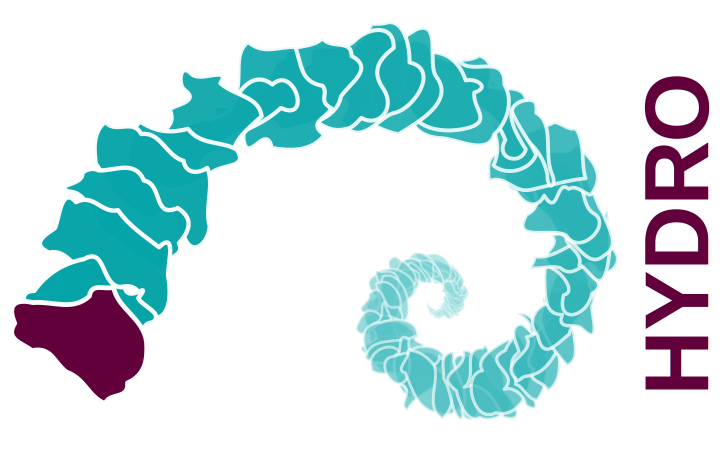

```{r include=FALSE}
formatGR           <- '<strong><font color="#0BA6AA">%s</font></strong>'
GR_link            <- sprintf(formatGR, "<a href = 'https://webgr.inrae.fr/en/models/' title='GR models' rel='noopener noreferrer nofollow' onclick='window.open(this.href); return false;'>GR</a>")
airGR              <- sprintf(formatGR, "airGR")
airGR_link         <- sprintf(formatGR, "<a href = 'https://hydrogr.github.io/airGR/' title='airGR' rel='noopener noreferrer nofollow' onclick='window.open(this.href); return false;'>airGR</a>")
airGRteaching      <- sprintf(formatGR, "airGRteaching")
airGRteaching_link <- sprintf(formatGR, "<a href = 'https://hydrogr.github.io/airGRteaching/' title='airGRteaching' rel='noopener noreferrer nofollow' onclick='window.open(this.href); return false;'>airGRteaching</a>")
```


<table  width="100%">
<tbody>
  <tr>
  <td width="110"></td>
  <td width="130"></td>
  <td>The `r GR_link` models and the `r airGR_link` &amp; `r airGRteaching_link` packages are developed by the <strong><i><a href = 'https://webgr.inrae.fr/en/' onclick='window.open(this.href); return false;'>Catchment Hydrology Team</a></i></strong> of <strong><a href = 'http://www.inrae.fr/en/' onclick='window.open(this.href); return false;'><strong>INRAE</strong></a></strong> at Antony, France.
  </tr>
</tbody>
</table>
  
<br>


#### `r airGRteaching` authors and contributors

<table  width="100%">
<tbody>

  <tr>
  <td width="115"></td>
  <td><strong><font color="#62003C">Olivier DELAIGUE</font></strong>
  <br><strong><i>Data scientist</i></strong>
  <br>INRAE
  <br>Main developer of the package
  <br>Maintainer of the package
  </tr>
  
  <tr>
  <td width="115"></td>
  <td><strong><font color="#62003C">Laurent CORON</font></strong>
  <br><strong><i>Hydrological and meteorological forecaster</i></strong><br>Now at Electricity of France (EDF)
  <br>Co-developer
  </tr>

  <tr>
  <td width="115"></td>
  <td><strong><font color="#62003C">Pierre BRIGODE</font></strong>
  <br><strong><i>Hydrologist</i></strong><br>Now at the university of Nice - Polytech
  <br>Co-developer
  </tr>
  
  <tr>
  <td width="115"> </td>
  <td><strong><font color="#62003C">Guillaume THIREL</font></strong>
  <br><strong><i>Hydrologist</i></strong>
  <br>INRAE
  <br>Contributor
  </tr>

</tbody>
</table>

<br><br><br><br>


#### `r airGR` authors and contributors

<table  width="100%">
<tbody>

  <tr>
  <td width="115"></td>
  <td><strong><font color="#62003C">Laurent CORON</font></strong>
  <br><strong><i>Hydrological and meteorological forecaster</i></strong>
  <br>Now at Electricity of France (EDF)
  <br>Original developer of the package
  </tr>

  <tr>
  <td width="115"></td>
  <td><strong><font color="#62003C">Olivier DELAIGUE</font></strong>
  <br><strong><i>Data scientist</i></strong>
  <br>INRAE
  <br>Current developer
  <br>Main maintainer of the package
  </tr>

  <tr>
  <td width="115"> </td>
  <td><strong><font color="#62003C">Guillaume THIREL</font></strong>
  <br><strong><i>Hydrologist</i></strong>
  <br>INRAE
  <br>Current developer
  <br>Maintainer of the package
  </tr>
  
  <tr>
  <td width="115"></td>
  <td><strong><font color="#62003C">Charles PERRIN</font></strong>
  <br><strong><i>Hydrologist</i></strong>
  <br>INRAE
  <br>Maintainer of the GR Fortran codes
  </tr>
  
  <tr>
  <td width="115"></td>
  <td><strong><font color="#62003C">Claude MICHEL</font></strong>
  <br><strong><i>Hydrologist</i></strong> (retired)
  <br>INRAE
  <br>Main creator of the original GR Fortran codes
  <br>Creator of the GR models structure
  </tr>

  <tr>
  <td width="115"> </td>
  <td><strong><font color="#62003C">CATCHMENT HYDROLOGY TEAM</font></strong>
  <br>Contributions to the Fortran codes
  <br>Contributions to the GR models development
  </tr>  
  
</tbody>
</table>


