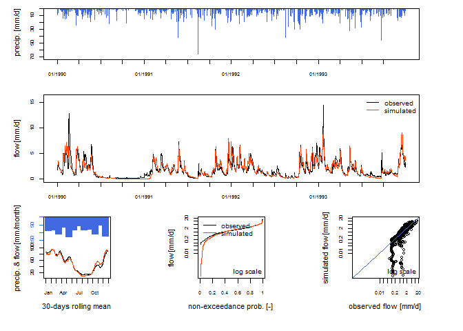

<table  width="100%">
<tbody>
  <tr>
  <td width="125"></td>
  <td><h4>
<font color="#0BA6AA">
To obtain help regarding the use of the <strong><font color="#62003C">airGRteaching</font></strong> or <strong><font color="#62003C">airGR</font></strong> packages, or to suggest modifications, send an email to <font color="#62003C"><strong>airGR@inrae.fr</strong></font>
</font>
</h4>
  </tr>
</tbody>
</table>

<br>


### How to run the <strong><font color="#0BA6AA">airGR</font></strong> hydrological models in  only three simple steps with <strong><font color="#0BA6AA">airGRteaching</font></strong>


#### Preparation of observed data for modelling

A `data.frame` of daily hydrometeorological observations time series at the catchment scale is needed. The required fields are:

  * *DatesR* : dates in the `POSIXt` format 
  * *P* : average precipitation [mm/time step]
  * *T* : catchment average air temperature [&#8451;] [OPTIONAL]
  * *E* : catchment average potential evapotranspiration [mm/time step]
  * *Qmm* : outlet discharge [mm/time step]
  

```r
head(BasinObs)
```

```
##       DatesR    P   E    Qmm    T
## 1 1984-01-01  4.1 0.2 0.6336  0.5
## 2 1984-01-02 15.9 0.2 0.8256  0.2
## 3 1984-01-03  0.8 0.3 2.9280  0.9
## 4 1984-01-04  0.0 0.3 1.8240  0.5
## 5 1984-01-05  0.0 0.1 1.5000 -1.6
## 6 1984-01-06  0.0 0.3 1.3560  0.9
```

Before running a model, <strong><font color="#0BA6AA">airGRteaching</font></strong> functions require data and options with specific formats.

For this step, you just have to use the `PrepGR()` function. You have to define:

  * `ObsDF`: `data.frame` of hydrometeorological observations time series
  * `HydroModel`: the name of the hydrological model you want to run (GR1A, GR2M, GR4J, GR5J, GR6J, GR4H or GR5H)
  * `CemaNeige`: if you want or not to use the snowmelt and accumulation model

If you want to use CemaNeige, you also have to define:

  * catchment average air temperature in `ObsDF` or in `TempMean`
  * `HypsoData`: a vector of 101 reals: min, quantiles (1 % to 99 %) and max of catchment elevation distribution [m]; if not defined a single elevation layer is used for CemaNeige
  * `NLayers`: the number of elevation layers requested [-]
  

```r
PREP <- PrepGR(ObsDF = BasinObs, HydroModel = "GR5J", CemaNeige = FALSE)
```

<br>

#### Calibration step

To calibrate a model, you just have to use the `CalGR()` function. By default, the objective function used is the Nash–Sutcliffe criterion (`"NSE"`), and the warm-up period is automatically set (depends on model). You just have to define:

  * `PrepGR`: the object returned by the `PrepGR()` function
  * `CalPer`: a vector of 2 dates to define the calibration period


You can obviously define another objective function or warm-up period:

  * `CalCrit`: name of the objective function (`"NSE", "KGE", "KGE2", "RMSE"`)
  * `WupPer`: a vector of 2 dates to define the warm-up period
  
The calibration algorithm has been developed by Claude Michel (`Calibration_Michel()` function in the <strong><font color="#0BA6AA">airGR</font></strong> package) .


```r
CAL <- CalGR(PrepGR = PREP, CalCrit = "KGE2",
             WupPer = NULL, CalPer = c("1990-01-01", "1993-12-31"))
```

```
## Grid-Screening in progress (0% 20% 40% 60% 80% 100%)
## 	 Screening completed (243 runs)
## 	     Param =  175.915,   -0.110,   83.931,    1.857,    0.467
## 	     Crit. KGE2[Q]      = 0.8300
## Steepest-descent local search in progress
## 	 Calibration completed (18 iterations, 406 runs)
## 	     Param =  188.670,    1.456,   83.931,    1.779,    0.493
## 	     Crit. KGE2[Q]      = 0.8787
```

<br>

#### Simulation step

To run a model, please use the `SimGR()` function. The `PrepGR` and `WupPer` arguments of `SimGR()` are similar to the ones of the `CalGR()` function. Here, `EffCrit` is used to calculate the performance of the model over the simulation period `SimPer` and `CalGR` is the object returned by the `CalGR()` function.


```r
SIM <- SimGR(PrepGR = PREP, CalGR = CAL, EffCrit = "KGE2",
             WupPer = NULL, SimPer = c("1994-01-01", "1998-12-31"))
```

```
## Crit. KGE2[Q] = 0.8549
```

```
## 	SubCrit. KGE2[Q] cor(sim, obs, "pearson") = 0.9012 
## 	SubCrit. KGE2[Q] cv(sim)/cv(obs)          = 0.8974 
## 	SubCrit. KGE2[Q] mean(sim)/mean(obs)      = 0.9724
```

<br>


### Formating outputs

The call of the `as.data.frame()` function with `PrepGR`, `CalGR` or `SimGR` objects allows to coerce the outputs to a data frame.


```r
head(as.data.frame(PREP))
```

```
##        Dates PotEvap PrecipObs PrecipFracSolid_CemaNeige TempMeanSim_CemaNeige
## 1 1984-01-01     0.2       4.1                        NA                    NA
## 2 1984-01-02     0.2      15.9                        NA                    NA
## 3 1984-01-03     0.3       0.8                        NA                    NA
## 4 1984-01-04     0.3       0.0                        NA                    NA
## 5 1984-01-05     0.1       0.0                        NA                    NA
## 6 1984-01-06     0.3       0.0                        NA                    NA
##     Qobs Qsim
## 1 0.6336   NA
## 2 0.8256   NA
## 3 2.9280   NA
## 4 1.8240   NA
## 5 1.5000   NA
## 6 1.3560   NA
```

```r
head(as.data.frame(CAL))
```

```
##        Dates PotEvap PrecipObs PrecipFracSolid_CemaNeige TempMeanSim_CemaNeige
## 1 1990-01-01     0.3       0.0                        NA                    NA
## 2 1990-01-02     0.4       9.3                        NA                    NA
## 3 1990-01-03     0.4       3.2                        NA                    NA
## 4 1990-01-04     0.3       7.3                        NA                    NA
## 5 1990-01-05     0.1       0.0                        NA                    NA
## 6 1990-01-06     0.1       0.0                        NA                    NA
##    Qobs     Qsim
## 1 1.992 2.523954
## 2 1.800 2.446199
## 3 2.856 2.943436
## 4 2.400 3.286214
## 5 3.312 3.512572
## 6 3.072 3.224969
```

```r
head(as.data.frame(SIM))
```

```
##        Dates PotEvap PrecipObs PrecipFracSolid_CemaNeige TempMeanSim_CemaNeige
## 1 1994-01-01     0.4       2.2                        NA                    NA
## 2 1994-01-02     0.4       0.0                        NA                    NA
## 3 1994-01-03     0.6       0.7                        NA                    NA
## 4 1994-01-04     0.6       3.2                        NA                    NA
## 5 1994-01-05     0.6      35.1                        NA                    NA
## 6 1994-01-06     0.5      21.3                        NA                    NA
##    Qobs     Qsim
## 1 2.904 3.593023
## 2 2.832 3.414026
## 3 2.364 2.988078
## 4 2.544 2.668972
## 5 2.640 3.526016
## 6 8.928 8.819935
```


### Formating outputs

The call of the `as.data.frame()` function with `PrepGR`, `CalGR` or `SimGR` objects allows to coerce the outputs to a data frame.


```r
head(as.data.frame(PREP))
```

```
##        Dates PotEvap PrecipObs PrecipFracSolid_CemaNeige TempMeanSim_CemaNeige
## 1 1984-01-01     0.2       4.1                        NA                    NA
## 2 1984-01-02     0.2      15.9                        NA                    NA
## 3 1984-01-03     0.3       0.8                        NA                    NA
## 4 1984-01-04     0.3       0.0                        NA                    NA
## 5 1984-01-05     0.1       0.0                        NA                    NA
## 6 1984-01-06     0.3       0.0                        NA                    NA
##     Qobs Qsim
## 1 0.6336   NA
## 2 0.8256   NA
## 3 2.9280   NA
## 4 1.8240   NA
## 5 1.5000   NA
## 6 1.3560   NA
```

```r
head(as.data.frame(CAL))
```

```
##        Dates PotEvap PrecipObs PrecipFracSolid_CemaNeige TempMeanSim_CemaNeige
## 1 1990-01-01     0.3       0.0                        NA                    NA
## 2 1990-01-02     0.4       9.3                        NA                    NA
## 3 1990-01-03     0.4       3.2                        NA                    NA
## 4 1990-01-04     0.3       7.3                        NA                    NA
## 5 1990-01-05     0.1       0.0                        NA                    NA
## 6 1990-01-06     0.1       0.0                        NA                    NA
##    Qobs     Qsim
## 1 1.992 2.523954
## 2 1.800 2.446199
## 3 2.856 2.943436
## 4 2.400 3.286214
## 5 3.312 3.512572
## 6 3.072 3.224969
```

```r
head(as.data.frame(SIM))
```

```
##        Dates PotEvap PrecipObs PrecipFracSolid_CemaNeige TempMeanSim_CemaNeige
## 1 1994-01-01     0.4       2.2                        NA                    NA
## 2 1994-01-02     0.4       0.0                        NA                    NA
## 3 1994-01-03     0.6       0.7                        NA                    NA
## 4 1994-01-04     0.6       3.2                        NA                    NA
## 5 1994-01-05     0.6      35.1                        NA                    NA
## 6 1994-01-06     0.5      21.3                        NA                    NA
##    Qobs     Qsim
## 1 2.904 3.593023
## 2 2.832 3.414026
## 3 2.364 2.988078
## 4 2.544 2.668972
## 5 2.640 3.526016
## 6 8.928 8.819935
```


### Pre-defined  graphical plots

#### Static plots

The call of the `plot()` function with a `PrepGR` object draws the observed precipitation and discharge time series.


```r
plot(PREP, main = "Observation")
```

<!-- -->


By default (with the argument `which = "perf"`), the call of the `plot()` function with a `CalGR` object draws the classical <strong><font color="#0BA6AA">airGR</font></strong> plot diagnostics (observed and simulated time series together with diagnostic plot)


```r
plot(CAL, which = "perf")
```
<!-- -->

With the `CalGR` object, if the argument `which` is set to `"iter"`, the `plot()` function draws the evolution of the parameters and the values of the objective function during the second step of the calibration (steepest descent local search algorithm):


```r
plot(CAL, which = "iter")
```

<!-- -->

With the `CalGR` object, if the argument `which` is set to `"ts"`, the `plot()` function simply draws the time series of the observed precipitation, and the observed and simulated flows:


```r
plot(CAL, which = "ts", main = "Calibration")
```

<!-- -->

The call of the `plot()` function with a `SimGR` object draws the classical <strong><font color="#0BA6AA">airGR</font></strong> plot diagnostics.

```r
plot(SIM)
```

<br>

#### Dynamic plots

Dynamic plots, using the *dygraphs* JavaScript charting library, can be displayed by the package.

The `dyplot()` function can be applied on `PrepGR`, `CalGR` and `SimGR` objects and draws the time series of the observed precipitation, and the observed and simulated (except with `PrepGR` objects) flows.

The user can zoom on the plot device and can read the exact values.

With this function, users can easily explore the data time series and also explore and interpret the possible problems of the calibration or simulation steps.


```r
dyplot(SIM, main = "Simulation")
```

<iframe src="fig/ShinyGR_dyplot.html", width = "670", height = "350"></iframe> 

<br>


### Graphical user interface

The <strong><font color="#0BA6AA">airGRteaching</font></strong> package also provides the `ShinyGR()` function, which allows to launch a graphical user interface using the *shiny* package.

The `ShinyGR()` function needs at least:

  * `ObsDF`: a (list of) `data.frame` (or independant vector instead, see `?ShinyGR`)
  * `SimPer`: a (list of) vector(s) of 2 dates to define the simulation period(s)

  

```r
ShinyGR(ObsDF = BasinObs, SimPer = c("1994-01-01", "1998-12-31"))
```

Only monthly and daily models are currently available (GR2M, GR4J, GR5J, GR6J + CemaNeige).

If you want to use CemaNeige, you also have to define the same arguments desribed above for the `PrepGR()` function.

It is also possible to change the interface look; different themes are proposed (`theme` argument).
<div><center><image src="fig/airGRteaching_GUI_MD_theme-RStudio_550x300.png" width="24%" height="24%"> <image src="fig/airGRteaching_GUI_MD_theme-Cerulean_550x300.png" width="24%" height="24%"> <image src="fig/airGRteaching_GUI_MD_theme-Cyborg_544x300.png" width="24%" height="24%"> <image src="fig/airGRteaching_GUI_MD_theme-Flatly_550x300.png" width="24%" height="24%"></center></div>
<div><center><image src="fig/airGRteaching_GUI_MD_theme-Inrae_550x300.png" width="24%" height="24%"> <image src="fig/airGRteaching_GUI_MD_theme-Saclay_550x300.png" width="24%" height="24%"> <image src="fig/airGRteaching_GUI_MD_theme-United_550x300.png" width="24%" height="24%"> <image src="fig/airGRteaching_GUI_MD_theme-Yeti_550x300.png" width="24%" height="24%"></center></div>

